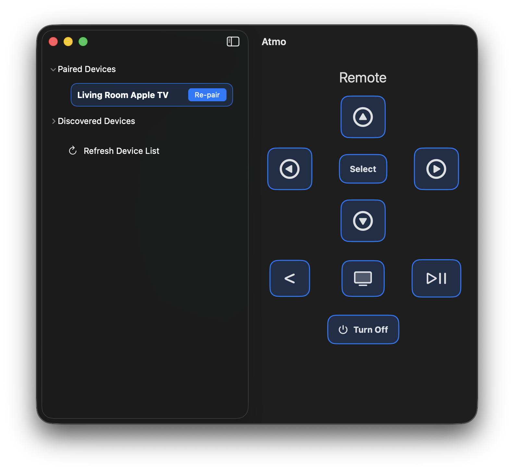
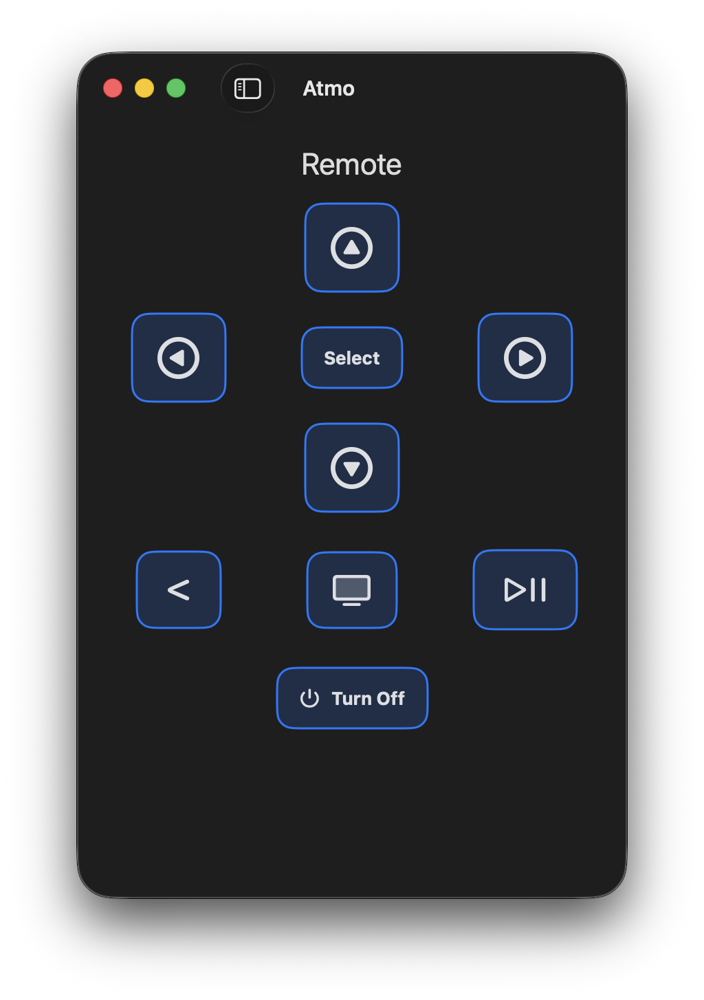
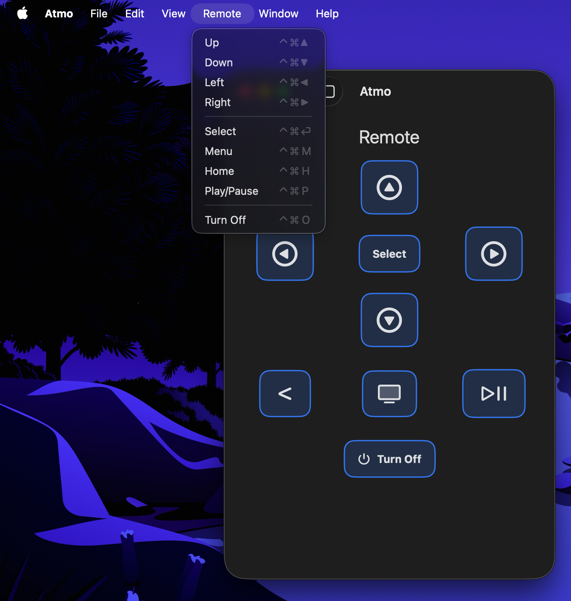

# Atmo - Apple TV Remote

Atmo is a macOS SwiftUI application for discovering and controlling Apple TV devices using the [`pyatv`](https://github.com/postlund/pyatv) library via an embedded Python bridge.



## Features
- Discover and pair Apple TV devices on the local network.
- Control playback via remote buttons or keyboard shortcuts.
- Print a formatted report of discovered devices.

## Architecture 

- SwiftUI Frontend (`AppleTVRemoteApp/Sources/Atmo`)
  - `ContentView` hosts UI.
  - `BridgeViewModel` (MainActor) owns app state, dispatching commands and pairing requests to the bridge and surfacing status feedback.
   - `BridgeService` actor launches the embedded Python interpreter from `Sources/Atmo/Resources/Python`, handles JSON I/O, and maintains interactive pairing sessions per device.
- Python Bridge (`pybridge/`)
  - CLI entry point (`cli.py`) exposes subcommands: `scan`, `pair`, `unpair`, `command`, and `power`.
  - Helpers such as `discovery.py`, `control.py`, and `pairing.py` wrap `pyatv`, return dataclasses, and emit JSON for the Swift side.
  - Tests under `tests/` use `pytest`/`unittest` with mocks to validate CLI behaviour without hitting real hardware.

## Getting Started

1. **Install Python dependencies**
   ```bash
   cd AppleTVRemoteApp
   python3 -m venv ../.venv
   ../.venv/bin/pip install pyatv
   bash Scripts/package_python.sh
   ```
2. **Build and run the Swift app**
   ```bash
   xcrun swift build
   xcrun swift run Atmo
   ```
3. **Run Swift unit tests**
   ```bash
   xcrun swift test
   ```
4. **Run Python tests**
   ```bash
   cd ..
   ../.venv/bin/python -m pytest tests
   ```

## Usage

Open the app and allow it to discover devices on the local network.

Click on a discovered Apple TV and click the Pair button.



Access File ▸ Print Discovered Devices (`⌘P`) for a printable summary of hostnames, services, and identifiers.



## Todo

- Add Shortcuts support.

## Building 

Use `bash AppleTVRemoteApp/Scripts/release.sh` to build an `.app` bundle in `dist/` with the vendored Python environment.

